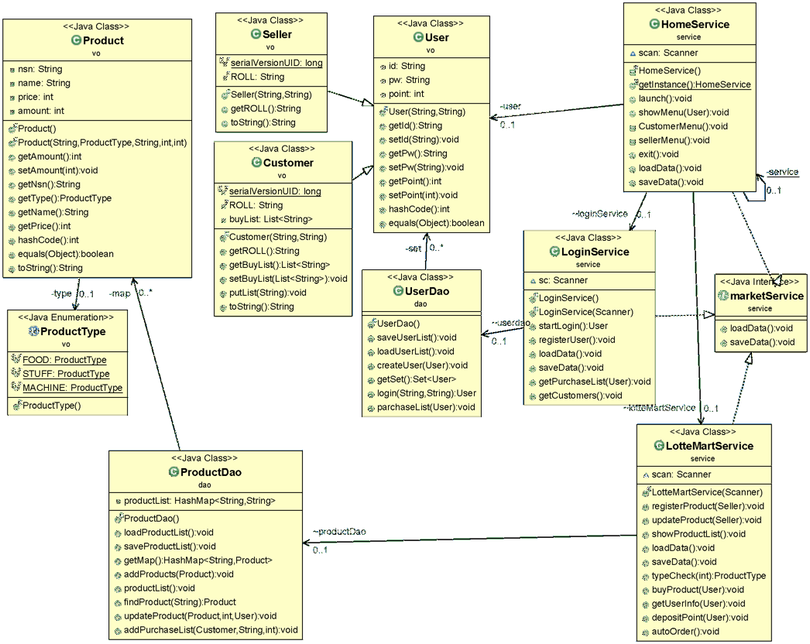
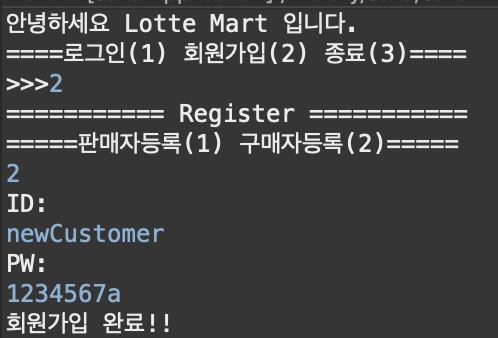
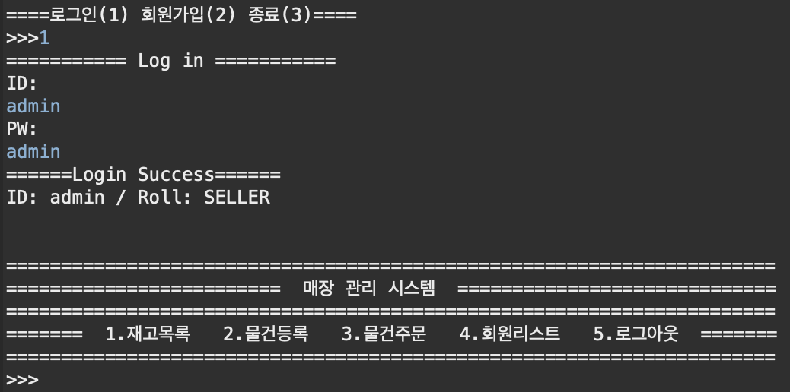
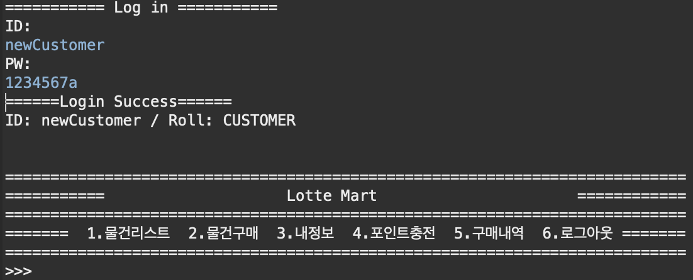

# StoreManagementProject


## Java market 관리 시스템

* Java 언어와 콘솔을 이용하여 매장 관리 시스템을 구현.
* 판매자, 구매자 아이디로 로그인 하여 서로 다른 시스템을 이용.


## 구조 ( UML )



## 기능


1. 회원가입.

   * 아이디, 비밀번호를 입력하여 회원가입 가능.
   * 가입시 판매자 or 구매자를 선택할 수 있음.
   * 가입된 정보를 ObjectOutputStream을 이용하여 UserDao.dat 에 갱신.

   

2. 로그인.

   * UserDao.dat 에 존재하는 아이디 비밀번호 입력시 로그인 가능.

   * 로그인 된 유저객체의 클래스(Seller / Customer)를 판별하여 각각 다른 메뉴를 화면에 띄워줌.

   * Seller

     

   * Customer

     

   * 유저 판별 메소드

     ```java
     	public void showMenu(User user) {
     		if (user instanceof Seller) {
     			sellerMenu();
     		} else if (user instanceof Customer) {
     			CustomerMenu();
     		}
     	}
     ```

3. 판매자

   1. 물건리스트 확인.
   2. 새로운 물건등록.
   3. 10개 미만 재고 확인 및 추가주문.
   4. 가입된 회원 (Customer) 리스트 확인.
   5. 로그아웃.

4. 구매자

   1. 물건 목록확인.
   2. 물건 구매.
   3. 내정보 확인하기.
   4. 포인트 충전하기.
   5. 구매내역.
   6. 로그아웃.


## 사용기술

* 콘솔을 이용하지만 MVC 패턴을 적용하고자 노력함.

  * Model
    * Product: 제품객체
    * User: 회원객체
    * ProductDao: 제품 추가,수정
    * UserDao: 유저 등록, 확인
  * Controller 
    * HomeService: 전체적인 실행 서비스
    * LoginService: 회원 로그인확인, 회원등록 서비스
    * LotteMartService: 제품 등록, 구매 확인 서비스


* Object Input/Output Stream 을 이용하여 이용할 데이터를 이용함.

  * EX) 유저객체 load, save

  ```java
  public void loadUserList() {
  		try (ObjectInputStream ois = new ObjectInputStream(new FileInputStream("src/dat/users.dat"))) {
  			while (true) {
  				try {
  					set = (Set<User>) ois.readObject();
  				} catch (EOFException e) {
  					break;
  				} catch (ClassNotFoundException e) {
  					e.printStackTrace();
  				}
  			}
  
  		} catch (FileNotFoundException e) {
  			System.out.println("저장된 데이터 없음.");
  		} catch (IOException e) {
  			System.out.println("읽어오기 실패.");
  		}
  	}
  
  public void saveUserList() {
  		try (ObjectOutputStream oos = new ObjectOutputStream(new FileOutputStream("src/dat/users.dat"))) {
  			oos.writeObject(set);
  			oos.flush();
  		} catch (FileNotFoundException e) {
  			e.printStackTrace();
  		} catch (IOException e) {
  			e.printStackTrace();
  		}
  	}
  ```


* `Product, User` 객체의 정보 비교를 위해 hashCode(), equals() 매서드 재정의.

  * `Product` 객체의 경우 각 제품의 NSN이 동일할 경우 같은 제품이라 비교하기 위하여 위 두 매서드를 재정의 함.

  ```java
  @Override
  	public int hashCode() {
  		final int prime = 31;
  		int result = 1;
  		result = prime * result + ((nsn == null) ? 0 : nsn.hashCode());
  		return result;
  	}
  
  	@Override
  	public boolean equals(Object obj) {
  		if (this == obj)
  			return true;
  		if (obj == null)
  			return false;
  		if (getClass() != obj.getClass())
  			return false;
  		Product other = (Product) obj;
  		if (nsn == null) {
  			if (other.nsn != null)
  				return false;
  		} else if (!nsn.equals(other.nsn))
  			return false;
  		return true;
  	}
  ```


  * `User` 객체의 경우 두 아이디 문자열이 같을 경우 동일한 해쉬코드 값을 갖도록 설정,
  * 아이디와 비밀번호가 같을 시 같은 객체로 판별.

  ```java
    @Override
  	public int hashCode() {
  		int code=0;
  		
  		for(int i=0; i<id.length(); i++) {
  			code += id.charAt(i) * (int)Math.pow(10, i);
  		}
  		return code;
  	}
  	
  	@Override
  	public boolean equals(Object obj) {
  		if(((User)obj).getId().equals(id) && ((User)obj).getPw().equals(pw))
  			return true;
  		return false;
  	}
  ```

  


